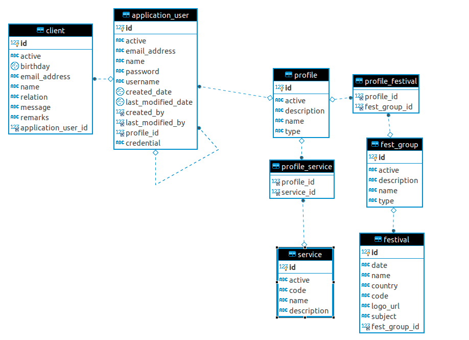
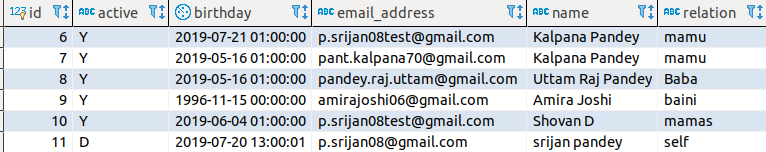

# Auto Email:

This is a concept project about sending auto email. The project was inspired by a problem that I face. 
I find it very difficult to remember peoples birthdays. However, I also wish to reach out to my friends and family in their
best of moments and wish them. 

To resolve this problem, I wanted to make a system, that would automatically reach out to people during birthdays and festivals,
once I set details about what message to send to them. 

In it's current version, the system, only sends out messages through email, the primary reason for this is because emailing service 
out of other services (such as whatsapp, direct message, viber) is free and programming for it won't cost me money. However, changing 
the implementation from one service to another would only mean making another service layer that processes and dispatches data for 
the particular phyical service (ie whatsapp). Implication of which is that we can change the service layer, depending on the actual service 
messaging system and still have most of the code reused.

The application of this project could be in making
1. Auto Alert systems 
1. Corporate Email and Notification System (which is what I've named the repository)
1. Notification and Reminder Systems

# Design

The Application User is the main user of the system. This is the person/company etc for whom this system will send out messages. The clients are application users contacts, who get the message from user.

The decision on the type of messages to send will be done through the services available in the application users profile. For instance we could have  

1. Birthday Alerts - Send the Application User alert that a clients birthday is coming tomorrow. 
1. Festival Wish - Send out personal message to clients, wishing them on a particular festival.
1. Birthday Wish - Automatically send Birthday Wish to clients by Application Users name, during clients birthday date.

As different combination of services can be mapped to the profile of any given user, we can add different services to individual users.   

The ER Diagram 

## How Mails are Automated? 

The clients have birthday as an attribute. A cronjob picks each users clients, if birthday wish or alert services are active, and checks if today is the birthday of the client.
Depending on if it is a clients birthday, the system creates a customized message based on domain information 
from the table and uses mail api to dispatch message.

## How Alerts are issued? 
If I am an application user, it's not just enough to send out a automated email to the user. I would also want to know the user's birthday and possibly want to call them. So another service picks up the users hourly and sees if tomorrow is clients birthday. If it is , it sends the application user notification email saying tomorrow is a client x's birthday. 

It seems very counter intuitive to have an email system send alerts, when we already have facebook which does the same. But the essense is that, email service is a replaceable service which can be replaced with a whatsapp message or a call. (If you are willing to buy me a twilo API, I can send you a whatsapp message too and likewise for other services). 

 

